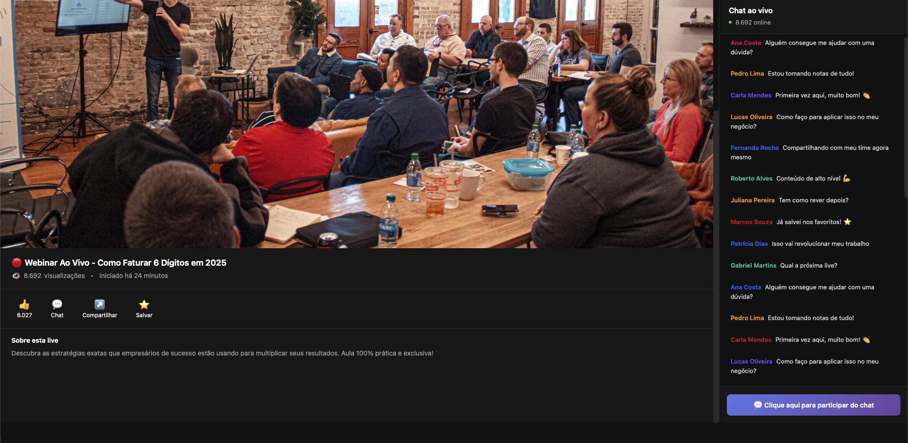
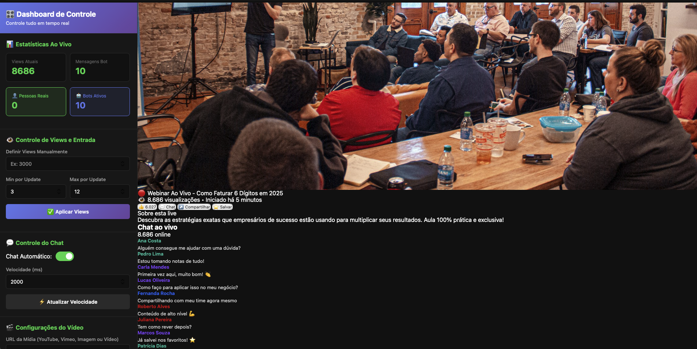
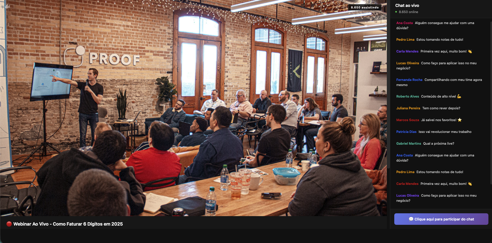

# 🎬 Fake Webinar Live Simulator

**Simule webinars ao vivo perfeitos com chat interativo, contadores de visualizações e efeitos realistas de transmissão.**

<div align="center">


<br><br>

### 🎥 Veja Como Funciona

<table>
  <tr>
    <td align="center">
      
      <br>
      <b>Interface do Webinar</b>
      <br>
      <sub>Transmissão ao vivo realista</sub>
    </td>
    <td align="center">
      
      <br>
      <b>Dashboard de Controle</b>
      <br>
      <sub>Configuração completa e intuitiva</sub>
    </td>
  </tr>
</table>

</div>

---

## 📋 Índice

- [📸 Screenshots](#-screenshots)
- [📖 Sobre o Projeto](#-sobre-o-projeto)
- [✨ Principais Funcionalidades](#-principais-funcionalidades)
- [🚀 Como Usar](#-como-usar)
- [📁 Estrutura do Projeto](#-estrutura-do-projeto)
- [💡 Casos de Uso](#-casos-de-uso)
- [🛠️ Tecnologias Utilizadas](#️-tecnologias-utilizadas)
- [📋 Requisitos](#-requisitos)
- [🎯 Recursos Avançados](#-recursos-avançados)
- [🔒 Resetar para Modo Demo](#-resetar-para-modo-demo)
- [📝 Notas Importantes](#-notas-importantes)
- [🤝 Créditos](#-créditos)
- [📄 Licença](#-licença)
- [💬 Suporte](#-suporte)

---

## 📸 Screenshots

<div align="center">

### 🎬 Página do Webinar (Interface Pública)


*Interface principal do webinar com vídeo ao vivo, chat interativo e contadores de visualizações em tempo real*

<br><br>



*Detalhes da transmissão ao vivo com efeitos visuais realistas e chat ativo*

<br><br>

### 🎛️ Dashboard de Controle


*Painel de controle completo com preview em tempo real, configurações de vídeo, chat e estatísticas*

</div>

---

## 📖 Sobre o Projeto

**Fake Webinar Live** é uma ferramenta completa para criar simulações realistas de webinars ao vivo. Perfeito para estratégias de marketing, vendas, lançamentos de produtos e eventos pré-gravados que precisam ter a aparência e sensação de transmissão ao vivo.

A plataforma oferece um dashboard intuitivo para controle total da experiência, incluindo chat automatizado, contadores de visualizações dinâmicos e efeitos visuais que replicam perfeitamente uma transmissão real.

---

## ⚡ Quick Start

```bash
# 1. Clone o repositório
git clone https://github.com/gbsoficial/fake-webinar-live.git

# 2. Entre na pasta
cd fake-webinar-live

# 3. Abra o dashboard no navegador
# Dê duplo clique em: dashboard.html
```

**Pronto!** Configure seu webinar e abra `index.html` para ver o resultado. 🚀

---

## ✨ Principais Funcionalidades

<div align="center">

<table>
  <tr>
    <td width="33%" align="center">
      <h3>🎥 Suporte Multimídia</h3>
      <p align="left">
        ✅ Vídeos MP4 diretos<br>
        ✅ Google Drive integrado<br>
        ✅ YouTube (modo thumbnail)<br>
        ✅ Imagens estáticas<br>
        ✅ Vimeo e outros
      </p>
    </td>
    <td width="33%" align="center">
      <h3>💬 Chat Interativo</h3>
      <p align="left">
        ✅ Mensagens automáticas<br>
        ✅ Controle de velocidade<br>
        ✅ Programação por tempo<br>
        ✅ Avatares realistas<br>
        ✅ Separação bot/real
      </p>
    </td>
    <td width="33%" align="center">
      <h3>📊 Sistema de Views</h3>
      <p align="left">
        ✅ Contador dinâmico<br>
        ✅ Entrada gradual<br>
        ✅ Incremento aleatório<br>
        ✅ Stats em tempo real<br>
        ✅ Totalmente configurável
      </p>
    </td>
  </tr>
  <tr>
    <td width="33%" align="center">
      <h3>🎨 Efeitos de Live</h3>
      <p align="left">
        ✅ Badge "AO VIVO"<br>
        ✅ Ondas sonoras<br>
        ✅ Indicador HD<br>
        ✅ Barra de progresso<br>
        ✅ Efeitos visuais
      </p>
    </td>
    <td width="33%" align="center">
      <h3>🎛️ Dashboard</h3>
      <p align="left">
        ✅ Interface intuitiva<br>
        ✅ Preview em tempo real<br>
        ✅ Sem código necessário<br>
        ✅ Auto-sincronização<br>
        ✅ Estatísticas completas
      </p>
    </td>
    <td width="33%" align="center">
      <h3>⚡ Performance</h3>
      <p align="left">
        ✅ Carregamento rápido<br>
        ✅ Responsivo (mobile)<br>
        ✅ Sem dependências<br>
        ✅ Vanilla JavaScript<br>
        ✅ 100% otimizado
      </p>
    </td>
  </tr>
</table>

</div>

---

## 🚀 Como Usar

### 1️⃣ **Configuração Inicial**

Abra o `dashboard.html` no navegador e configure:

```
📹 Vídeo: Cole a URL do seu vídeo/imagem
📝 Título: Personalize o título do webinar
📋 Descrição: Adicione uma descrição atrativa
⏱️ Duração: Configure o tempo total em segundos
👁️ Views: Defina quantidade inicial e incremento
💬 Chat: Adicione mensagens e configure velocidade
```

### 2️⃣ **Adicionar Conteúdo**

**Vídeos suportados:**
- Link direto MP4: `https://seudominio.com/video.mp4`
- Google Drive: `https://drive.google.com/file/d/XXXXX/view`
- YouTube: `https://youtube.com/watch?v=XXXXX` (modo thumbnail)

**Mensagens do chat:**
- Adicione mensagens genéricas (sempre visíveis)
- Configure mensagens por timestamp (aparecem em tempo específico)

### 3️⃣ **Publicar**

Depois de configurar tudo no dashboard:

1. Clique em **"💾 Salvar Manualmente"**
2. Abra o **`index.html`** em outra aba
3. ✅ Seu webinar está no ar!

---

## 📁 Estrutura do Projeto

```
webinar/
├── index.html              # Página pública do webinar
├── dashboard.html          # Painel de controle
├── FakeWebinarLive.js      # Engine principal
├── demo.js                 # Inicialização e configs
├── styles.css              # Estilos completos
├── prints/                 # Screenshots do projeto
│   ├── index.png          # Interface principal
│   ├── index2.png         # Detalhes da transmissão
│   └── dashboard.png      # Painel de controle
└── README.md               # Documentação
```

---

## 💡 Casos de Uso

### 📈 **Marketing Digital**
- Lançamentos de produtos 24/7
- Webinars evergreen
- Funis de vendas automatizados

### 🎓 **Educação**
- Aulas pré-gravadas com interação
- Treinamentos corporativos
- Cursos online

### 💼 **Vendas**
- Demonstrações de produtos
- Apresentações comerciais
- Eventos de networking

### 🎪 **Eventos**
- Palestras gravadas
- Workshops online
- Transmissões simuladas

---

## 🛠️ Tecnologias Utilizadas

- **HTML5** - Estrutura e marcação
- **CSS3** - Estilos e animações avançadas
- **JavaScript (ES6+)** - Lógica e interatividade
- **LocalStorage API** - Persistência de dados
- **Responsive Design** - Layout adaptável

---

## 📋 Requisitos

- ✅ Navegador moderno (Chrome, Firefox, Safari, Edge)
- ✅ JavaScript habilitado
- ✅ LocalStorage habilitado
- ❌ Não requer servidor (funciona offline após carregar)
- ❌ Não requer banco de dados

---

## 🎯 Recursos Avançados

### 🔄 **Sincronização Automática**
Dashboard e webinar sincronizados em tempo real via `localStorage`

### 📱 **Totalmente Responsivo**
Funciona perfeitamente em desktop, tablet e mobile

### 🎨 **Customizável**
Cores, fontes e layouts facilmente modificáveis via CSS

### ⚡ **Performance**
Carregamento rápido e consumo mínimo de recursos

### 🔒 **Privacidade**
Tudo roda localmente, sem coleta de dados externos

---

## 🔒 Resetar para Modo Demo

**Antes de compartilhar ou publicar o projeto:**

Se você configurou seu próprio webinar e quer voltar para a versão de demonstração (para não expor seus links de vídeos), siga um dos métodos:

### **Método 1: Botão no Dashboard**
1. Abra o `dashboard.html`
2. Clique em **"🔄 Resetar para Demo"**
3. Confirme a ação
4. ✅ Projeto volta aos valores padrão com thumbnail de teste

### **Método 2: Console do Navegador**
```javascript
localStorage.removeItem('webinarConfig');
location.reload();
```

Isso garante que seu repositório GitHub terá apenas conteúdo de demonstração genérico! 🔒

---

## 📝 Notas Importantes

### **Vídeos do YouTube**
- Muitos vídeos bloqueiam embed (Erro 153)
- Sistema usa thumbnail automaticamente como fallback
- Para vídeos reais, recomendamos Google Drive, Vimeo ou MP4 direto

### **Vídeos Grandes**
- Comprima vídeos para 1080p antes de hospedar
- Vídeos >2GB podem ter problemas de processamento
- Use HandBrake ou ferramentas similares para otimização

### **Hospedagem**
- Para MP4 direto: cPanel, AWS S3, Cloudflare R2
- Para streaming: Vimeo, Bunny.net, Cloudflare Stream
- Google Drive: configure compartilhamento público

---

## 🤝 Créditos

<div align="center">

<table>
  <tr>
    <td align="center">
      <a href="https://github.com/gbsoficial">
        
        <br>
        <sub><b>Gabriel Bruno (GBS)</b></sub>
      </a>
      <br>
      <sub>Criador & Desenvolvedor</sub>
    </td>
  </tr>
</table>

**Idealização e Conceito:** Gabriel Bruno  
**Arquitetura e Design:** Gabriel Bruno  
**Implementação:** Gabriel Bruno com assistência de IA

</div>

---

## 📄 Licença

Este projeto está sob a licença MIT. Consulte o arquivo `LICENSE` para mais detalhes.

---

## 💬 Suporte

<div align="center">

Para dúvidas, sugestões ou problemas:

[](https://github.com/gbsoficial/fake-webinar-live/issues)
[](https://github.com/gbsoficial)

</div>

---

## 🚀 Próximas Atualizações

<div align="center">

| Feature | Status | Descrição |
|---------|--------|-----------|
| 📧 Sistema de Leads | 🔜 Em breve | Captura automática de emails |
| 🔗 Integração CRM | 🔜 Em breve | Webhook para CRMs populares |
| 📊 Analytics | 🔜 Em breve | Dashboard com métricas detalhadas |
| 🎨 Temas | 🔜 Em breve | Temas customizáveis (dark/light) |
| 💾 Export/Import | 🔜 Em breve | Exportar/importar configurações |
| 🔌 API | 🔜 Em breve | API REST para integrações |

</div>

---

<div align="center">

## ⭐ Gostou do Projeto?

**Deixe uma estrela no GitHub e ajude o projeto a crescer!**

<br>

[](https://github.com/gbsoficial/fake-webinar-live/stargazers)
[](https://github.com/gbsoficial/fake-webinar-live/network/members)

<br>

---

<br>

### 🎯 Projeto 100% Funcional | Pronto para Produção | Open Source

<br>

Feito com ❤️ por [Gabriel Bruno (GBS)](https://github.com/gbsoficial)

<br>

[](https://github.com/gbsoficial)

</div>

